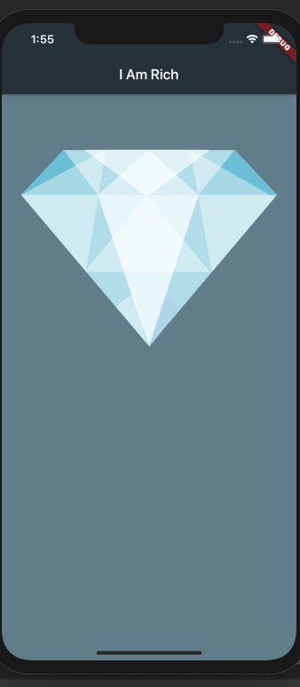
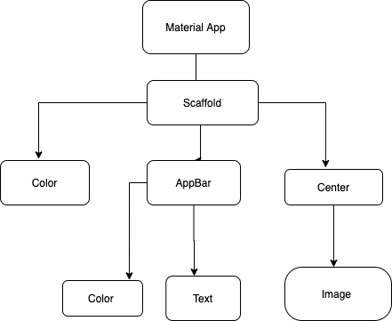
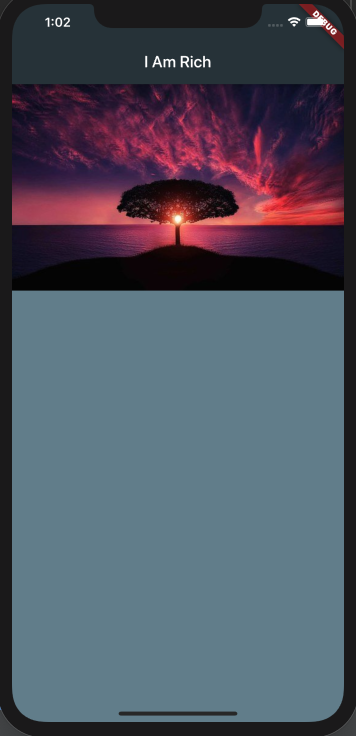

# i_am_rich

A new Flutter application.

## Getting Started

This project is a starting point for a Flutter application.

For help getting started with Flutter, view 
[online documentation](https://flutter.dev/docs), which offers tutorials,
samples, guidance on mobile development, and a full API reference.

## UX FLOWCHART OF I_AM_RICH APP

  
  
  

# INSTALLATIONS
## X-code

## Android Studio 

## draw.io to create the flowchart of the i-am-rich app

   ### Images 

 Using a url image link from the internet on flutter 
 
 
   

